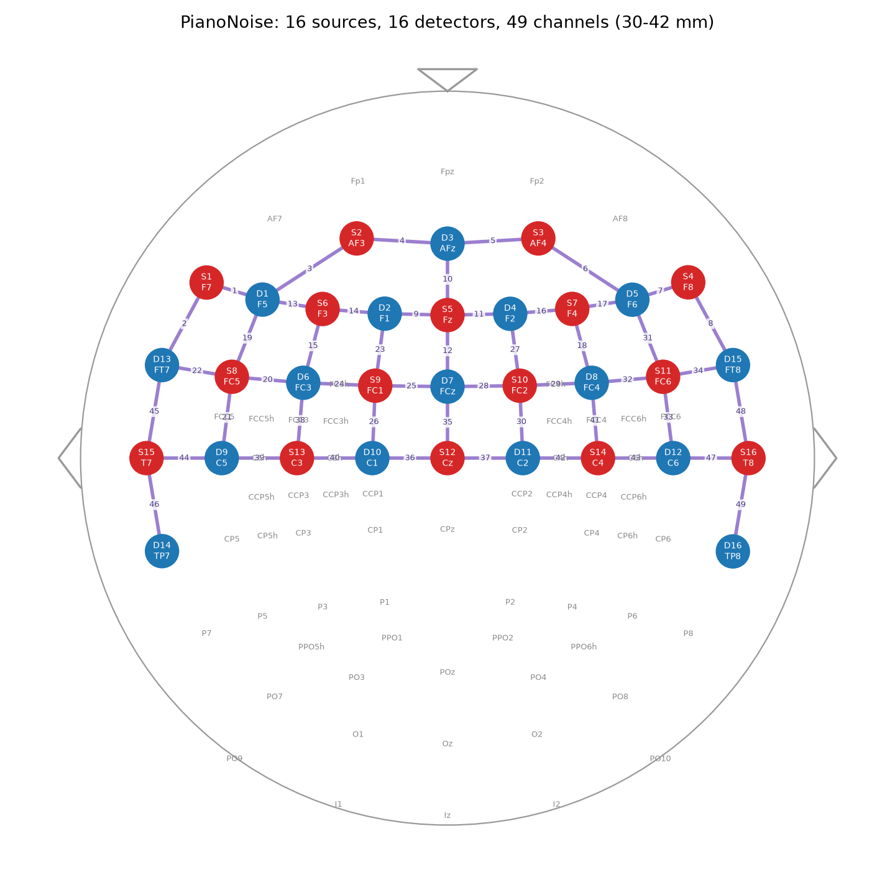

# Piano-in-noise fNIRS pilot (LYDIA)

Acquisition tooling for the protocol in `test_protocol_Lydia.pdf`: prefrontal /
premotor / SMA / sensorimotor / temporal fNIRS (NIRSport2, 16x16) while a pianist
plays a memorised piece in quiet (QP) and in multi-talker babble (NP), in a
natural and in an acoustically adjusted room.

```
plan.md                      task description
test_protocol_Lydia.pdf      the protocol
montage/make_montage.py      builds the Aurora montage from 10-10 labels (no NIRSite needed)
montage/positions_icbm152.csv  10-10/10-5 scalp positions on NIRSite's ICBM152 head
montage/aurora_template.ncfg   Aurora config template (device settings) the .ncfg is derived from
montage/out/PianoNoise/      generated montage folder  -> Documents\NIRx\Configurations\Montages\PianoNoise\
montage/out/PianoNoise.ncfg  generated Aurora config   -> Documents\NIRx\Configurations\
scripts/run_session.py       runs one session: LSL markers, block timing, cues, babble on/off, MIDI log
scripts/triggers.py          marker code table (single source of truth)
scripts/beep.py              1 kHz cue
scripts/noise.py             looped babble playback
scripts/midi_log.py          optional MIDI keyboard logger (LSL-clock timestamps)
logs/                        per-session json + log (commit these)
data/blocks.csv              one row per block; data/sessions.csv one row per session
data/midi/                   MIDI event CSVs
```

## Montage (`PianoNoise`, 16 sources x 16 detectors, 47 channels, 30-42 mm)

| region | optodes | channels |
|---|---|---|
| frontal pole / VLPFC | S: Fpz AF7 AF8; D: Fp1 Fp2 AFz | Fpz-Fp1/Fp2/AFz, AF7-Fp1, AF7-F5, mirrored right |
| DLPFC | S: AF3 AF4 Fz F3 F4; D: F5 F1 F2 F6 | AF3-Fp1/AFz/F5, Fz-F1/F2/AFz, F3-F5/F1/FC3, mirrored right |
| premotor / SMA | S: FC5 FC1 FC2 FC6; D: FC3 FCz FC4 | FC5-F5/FC3/C5/FT7, FC1-F1/FC3/FCz, Fz-FCz, mirrored right |
| sensorimotor (C3/C4) | S: C3 C4; D: C5 C6 | C3-C5, C3-FC3, C4-C6, C4-FC4 |
| temporal (auditory) | S: T7 T8; D: FT7 TP7 FT8 TP8 | T7-FT7, T7-TP7, T7-C5, mirrored right |

The hemispheres are joined only across the prefrontal midline (AFz, Fz, FCz);
motor and temporal coverage is two separate left/right strips (no Cz/C1/C2),
which paid for the frontal-pole row.



Notes for the protocol questions:
- 16 sources on one NIRSport2 give ~5.1 Hz (the 16x16 recordings in `~/nirs` are 5.09 Hz).
  Halving the sources would give ~10 Hz but loses a region; 5 Hz is plenty for a
  40/30 s block design and still resolves the heartbeat for QC.
- No short-separation channels (as the protocol says). The `.ncfg` has the
  accelerometer enabled. Rebuild with `--biosignals` if WINGS2 is used through Aurora.

### Rebuilding, changing or viewing a montage

```sh
python montage/make_montage.py                  # default PianoNoise montage
python montage/make_montage.py --list-labels    # which 10-10 labels are available
python montage/make_montage.py --name Test --sources Fz,Cz --detectors FCz,F1,C1
python montage/view_montage.py montage/out/PianoNoise/Standard_probeInfo.mat            # interactive 2-D + 3-D
python montage/view_montage.py "~/nirs/Configurations/Montages/DLPFCACC/Standard_probeInfo.mat" --table
python montage/view_montage.py a.mat b.mat --save compare.png                            # side by side
```

`view_montage.py` opens any `Standard_probeInfo.mat` (ours or NIRSite's):
NIRSite-style top view on the left, rotatable 3-D scalp view on the right,
channel colour = source-detector distance.

Edit `PIANO_NOISE` in `make_montage.py` to move optodes; channels are all
source-detector pairs within `min_mm..max_mm` (plus `include`/`exclude`).
The writer produces the same `Standard_probeInfo.mat` structure NIRSite 2023.9
exports (headmodel ICBM152, `probes` struct with coords/normals/labels), the
Aurora `.ncfg` (channel mask, detector plan, montage path, accelerometer) and
the NIRSite-style text files for reference. The cortex projection columns in
`Standard_Channels.txt` are approximate (15 mm below the scalp point).

## Session runner

### Setup (Windows 11 acquisition PC)

```
git clone https://github.com/adamaske/lydia-adept
cd lydia-adept\piano-noise
python -m venv .venv
.venv\Scripts\activate
pip install -r requirements.txt          # one venv for the session runner and the montage tools
```

Copy `montage\out\PianoNoise\` to `%USERPROFILE%\Documents\NIRx\Configurations\Montages\PianoNoise\`
and `montage\out\PianoNoise.ncfg` to `%USERPROFILE%\Documents\NIRx\Configurations\`, then load it in Aurora.

Put the babble file (PCM WAV, any length; it loops) in `stimuli\babble.wav`
(not in git). Calibrate its level to ~65 dB SPL at the player's head:

```
python scripts\run_session.py --noise stimuli\babble.wav --noise-test 30
```

### Run

```
python scripts\run_session.py --list-midi
python scripts\run_session.py --subject 1 --condition quiet                                   # quiet room
python scripts\run_session.py --subject 1 --condition noise                                   # noisy room (ambient noise)
python scripts\run_session.py --subject 1 --condition noise --noise stimuli\babble.wav        # synthetic babble per block
python scripts\run_session.py --subject 1 --condition noise --noise stimuli\babble.wav --noise-mode continuous --midi "Keystation"
python scripts\run_session.py --no-lsl --speed 20                 # 1-minute dry run, no LSL
python scripts\run_session.py --help
```

One session is one condition: all QP is recorded in the quiet room, then the
whole setup moves and all NP is recorded in the noisy room (`--condition`).
`--room natural|adjusted` is an optional extra label that adds a ROOM_* marker.
Start the Aurora recording first with the `Trigger` LSL stream selected as
trigger source. The session is fully timed: after ENTER it runs

```
SESSION_START, [ROOM_*], BASELINE 60 s,
3 runs x [ RUN_START, 6 x ( PLAY 40+/-8 s  ->  REST 30+/-5 s ) ], RUN_REST 120 s between runs,
SESSION_END                                          (~26 min)
```

Block lengths are jittered from `--seed` (printed and logged). The 1 kHz beep
marks every play onset (1 beep) and rest onset (2 beeps). In a noise session
`--noise-mode` says where the noise comes from:

| mode | what the script does | default |
|---|---|---|
| `ambient` | nothing but marking: the noise is already in the room | yes, without `--noise` |
| `blocks` | loops `--noise babble.wav` during play blocks (play marker to rest marker) | yes, with `--noise` |
| `continuous` | loops `--noise babble.wav` from SESSION_START to SESSION_END | |
| `manual` | prints NOISE ON / OFF at each block for an external source you switch by hand | |

So a real noisy-room session is simply `--condition noise`; the synthetic babble
stays available for a lab session with `--noise stimuli\babble.wav`.

MIDI logging is optional. Without `--midi` nothing MIDI-related is imported;
with `--midi` any failure (no mido, no such port, driver error) prints a warning
and the session runs on without it. Every marker in the session JSON carries
both the LSL time and the wall-clock time (`t_wall`), so a MIDI recording made
on the keyboard or another computer can be aligned afterwards.

After the session commit `logs/` and `data/` and push.
